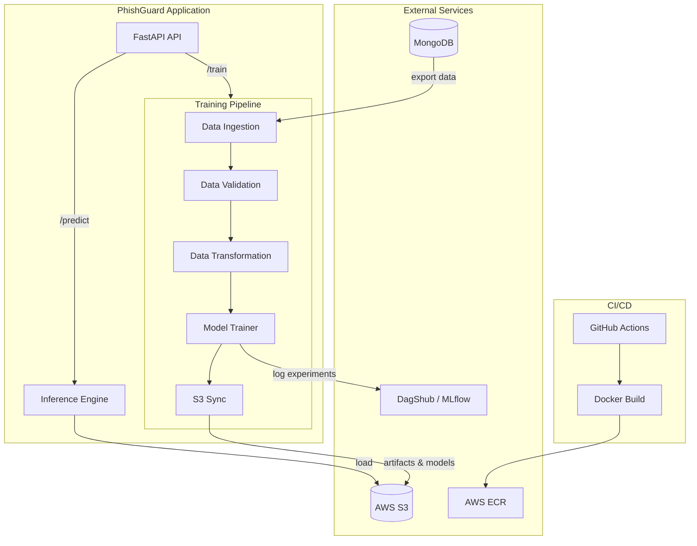

# phishguard-ml-pipeline
## Overview

This project implements a complete machine learning operations pipeline for detecting phishing websites. The goal is to build a production-ready system that can automatically train, validate, and deploy models to identify malicious URLs. The entire workflow is containerized and includes cloud integration for scalability and proper experiment tracking for reproducibility.

## Motivation

Phishing attacks continue to be one of the most prevalent cybersecurity threats, tricking users into revealing sensitive information through fake websites. Traditional blacklist-based approaches struggle to keep up with the rapidly changing tactics of attackers. This project addresses that problem by using machine learning to identify phishing websites based on their characteristics rather than relying on known malicious URLs.

The motivation behind building this as an MLOps pipeline rather than just a standalone model is to create a system that can:
- Continuously improve as new phishing patterns emerge
- Automatically detect when model performance degrades (data drift)
- Deploy updates without manual intervention
- Track experiments to understand what works and what doesn't
- Scale to handle real-world traffic loads

## Project Architecture

### System Architecture (High-Level)



### Training Pipeline Flow


> **Note:** The diagrams above use [Mermaid](https://mermaid.js.org/). They render automatically on GitHub, GitLab, and in many Markdown viewers.

### Component Overview

The pipeline follows a modular design with four main stages:

### 1. Data Ingestion
- Connects to MongoDB to retrieve phishing detection data
- Exports the dataset to a feature store for versioning
- Splits data into training and testing sets (80/20 split)
- Handles SSL/TLS certificate validation for secure connections

### 2. Data Validation
- Verifies that incoming data matches the expected schema (31 features)
- Performs statistical tests to detect data drift using the Kolmogorov-Smirnov test
- Generates validation reports to track data quality over time
- Separates valid and invalid data for further investigation

### 3. Data Transformation
- Applies KNN Imputation to handle missing values (k=3 neighbors)
- Creates preprocessing pipelines that can be reused during inference
- Converts data into formats optimized for model training
- Saves the preprocessing pipeline as an artifact for consistency

### 4. Model Training
- Tests multiple classification algorithms including Random Forest, Decision Trees, Gradient Boosting, Logistic Regression, and AdaBoost
- Uses GridSearchCV with 3-fold cross-validation for hyperparameter tuning
- Tracks all experiments using MLflow integrated with DagShub
- Calculates comprehensive metrics including F1 score, precision, and recall
- Selects the best performing model based on test set performance

## Dataset

The project uses a dataset of 31 numerical features extracted from URLs and web page content. These features capture various characteristics that distinguish phishing sites from legitimate ones:

**URL-based features:** URL length, presence of IP addresses, use of URL shortening services, special characters, number of redirects

**Domain features:** SSL certificate status, domain registration length, favicon source, domain age

**Content features:** Links in HTML tags, form submission methods, JavaScript events, external resources

**Reputation features:** Web traffic rankings, page rank, Google indexing status, links from other sites

The target variable is binary: 1 indicates a phishing website, 0 indicates a legitimate website.

## Technologies Used

**Machine Learning Stack:**
- scikit-learn for model training and preprocessing
- pandas and numpy for data manipulation
- scipy for statistical testing

**MLOps Tools:**
- MLflow for experiment tracking and model registry
- DagShub for remote experiment storage and collaboration

**Backend and API:**
- FastAPI for building the REST API
- uvicorn as the ASGI server
- Jinja2 for rendering prediction results

**Database and Storage:**
- MongoDB for data storage
- AWS S3 for artifact and model storage
- pymongo for database connections

**DevOps:**
- Docker for containerization
- GitHub Actions for CI/CD pipeline
- AWS ECR for container image registry

## Project Structure

```
End-to-End-MLOps-Pipeline/
├── networksecurity/              # Main application package
│   ├── components/               # Pipeline components
│   │   ├── data_ingestion.py
│   │   ├── data_validation.py
│   │   ├── data_transformation.py
│   │   └── model_trainer.py
│   ├── pipeline/                 # Orchestration logic
│   │   ├── training_pipeline.py
│   │   └── batch_prediction.py
│   ├── cloud/                    # Cloud integration
│   │   └── s3_syncer.py
│   ├── entity/                   # Data structures
│   │   ├── config_entity.py
│   │   └── artifact_entity.py
│   ├── utils/                    # Helper functions
│   ├── exception/                # Custom exception handling
│   └── logging/                  # Logging configuration
├── app.py                        # FastAPI application
├── main.py                       # Training pipeline entry point
├── push_data.py                  # MongoDB data loader
├── Dockerfile                    # Container definition
├── requirements.txt              # Python dependencies
├── data_schema/                  # Schema definitions
│   └── schema.yaml
├── Network_Data/                 # Source dataset
│   └── phisingData.csv
├── final_model/                  # Production models
│   ├── model.pkl
│   └── preprocessor.pkl
├── Artifacts/                    # Timestamped training runs
└── .github/workflows/            # CI/CD pipeline
    └── main.yml
```

## How It Works

### Training Pipeline

The training pipeline orchestrates all four stages sequentially:

1. Data is pulled from MongoDB and split into train/test sets
2. The validation component checks schema compliance and detects any drift from baseline distributions
3. Preprocessing steps are applied, and the transformation pipeline is saved
4. Multiple models are trained with hyperparameter tuning, and experiments are logged to MLflow
5. The best model is selected and saved along with its metrics
6. All artifacts are synced to AWS S3 for versioning and backup

Each pipeline run creates a timestamped directory in the Artifacts folder, making it easy to track and compare different runs.

### Inference API

The FastAPI application provides two main endpoints:

- `/train` - Triggers the complete training pipeline on demand
- `/predict` - Accepts CSV files with URL features and returns predictions

Predictions are returned both as downloadable CSV files and as HTML tables for easy viewing. The API is CORS-enabled, allowing it to be called from web applications.

## Setup and Installation

### Prerequisites

- Python 3.10 or higher
- MongoDB instance with phishing detection data
- AWS account with S3 and ECR access
- Docker (for containerized deployment)

### Local Development

1. Clone the repository
```bash
git clone <repository-url>
cd End-to-End-MLOps-Pipeline
```

2. Install dependencies
```bash
pip install -r requirements.txt
```

3. Set up environment variables
Create a `.env` file with the following:
```
MONGO_DB_URL=<your-mongodb-connection-string>
AWS_ACCESS_KEY_ID=<your-aws-access-key>
AWS_SECRET_ACCESS_KEY=<your-aws-secret-key>
MLFLOW_TRACKING_URI=<your-dagshub-mlflow-uri>
MLFLOW_TRACKING_USERNAME=<your-dagshub-username>
MLFLOW_TRACKING_PASSWORD=<your-dagshub-password>
```

4. Run the training pipeline
```bash
python main.py
```

5. Start the API server
```bash
python app.py
```

The API will be available at `http://localhost:8000`.

### Docker Deployment

Build the Docker image:
```bash
docker build -t phishing-detection .
```

Run the container:
```bash
docker run -p 8000:8000 --env-file .env phishing-detection
```

## CI/CD Pipeline

The project includes a GitHub Actions workflow that automatically:

1. Runs on push to the main branch
2. Builds a Docker image
3. Logs into AWS ECR
4. Pushes the image to ECR with appropriate tags

This enables continuous delivery of updates. The deployment step (pulling and running the image on a production server) is currently commented out but can be enabled when a self-hosted runner is configured.

## Experiment Tracking

All model training experiments are tracked using MLflow with remote storage on DagShub. For each training run, the following are logged:

- Model hyperparameters
- Training and test metrics (F1, precision, recall, R-squared)
- Model artifacts
- Preprocessing pipelines

This makes it easy to compare different approaches and reproduce results.

## Data Drift Detection

The validation component automatically detects data drift by comparing the distribution of each feature in the new data against the training data using the Kolmogorov-Smirnov test. If significant drift is detected (p-value < 0.05), a report is generated, and the system can trigger retraining.

## Model Performance

The pipeline tests five different classification algorithms and selects the best one based on test set performance. The current implementation requires a minimum R-squared score of 0.6, but this threshold is configurable. Models are evaluated using multiple metrics to get a complete picture of performance:

- F1 Score (harmonic mean of precision and recall)
- Precision (accuracy of positive predictions)
- Recall (coverage of actual positive cases)
- R-squared (coefficient of determination)

## Future Improvements

There are several areas where this pipeline could be extended:

- Add online learning capabilities to update models without full retraining
- Implement A/B testing to safely deploy new models
- Add monitoring dashboards for model performance in production
- Expand feature engineering with deep learning-based URL embeddings
- Implement automated alerting when drift or performance issues are detected
- Add comprehensive unit and integration tests
- Create a feedback loop to continuously collect labels for misclassified examples

## Contributing

This is an educational project demonstrating MLOps best practices. If you find issues or have suggestions for improvements, feel free to open an issue or submit a pull request.

## License

This project is available for educational and research purposes.

## Acknowledgments

The phishing detection dataset includes features based on research in web security and URL analysis. The MLOps architecture follows industry best practices for building production machine learning systems.
